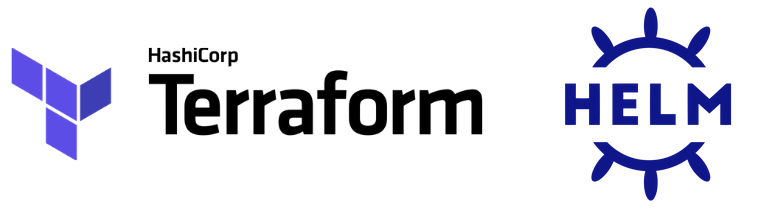
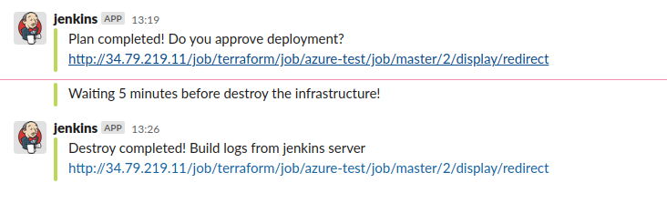

- [**Introducción**](#introducción)
- [**Objetivos**](#objetivos)
- [**Introducción a Terraform**](#introducción-a-terraform)
- [**Introducción a GKE**](#introducción-a-gke)
- [**Introducción a Jenkins**](#introducción-a-jenkins)
- [**Introducción a Prometheus**](#introducción-a-prometheus)
- [**Introducción a Grafana**](#introducción-a-grafana)
- [**Introducción a Slack**](#introducción-a-slack)
- [**Preparación de entorno**](#preparación-de-entorno)
- [**Clonación de repositorio**](#clonación-de-repositorio)
- [**Índice de ficheros**](#índice-de-ficheros)
- [**Configuración de Slack**](#configuración-de-slack)
- [**Configuración de variables**](#configuración-de-variables)
- [**Configuración VPC**](#configuración-vpc)
- [**Configuración GKE**](#configuración-gke)
- [**Configuración Jenkins**](#configuración-jenkins)
  - [**Configuración inicial de Jcasc**](#configuración-inicial-de-jcasc)
- [**Configuración Prometheus**](#configuración-prometheus)
- [**Configuración Grafana**](#configuración-grafana)
- [**Despliegue de la infraestructura**](#despliegue-de-la-infraestructura)
  - [**Revisión de la infraestructura**](#revisión-de-la-infraestructura)
  - [**Revisión de Jenkins**](#revisión-de-jenkins)
  - [**Revisión de Grafana**](#revisión-de-grafana)
- [**Job de prueba**](#job-de-prueba)
- [**Ejecución end to end**](#ejecución-end-to-end)
- [**Escalabilidad de la solución**](#escalabilidad-de-la-solución)
- [**Monitorización de la plataforma**](#monitorización-de-la-plataforma)
  - [**Dashboards**](#dashboards)
  - [**Alertas del sistema**](#alertas-del-sistema)
- [**Eliminación de recursos**](#eliminación-de-recursos)
- [**Conclusión**](#conclusión)
- [**Autor**](#autor)

## **Introducción**

En este artículo de la [práctica cloud](https://bluetab.net) veremos cómo crear una plataforma de CI/CD de una forma totalmente automatizada. Para ello nos apoyaremos en una metodología GitOps para así realizar nuestro despliegues de una forma más sencilla, escalable y automatizada.

La idea de este taller es crearnos un cluster de GKE donde tengamos desplegado Jenkins como nuestra pieza central de CI/CD y que este vaya escalando en [agentes](https://plugins.jenkins.io/kubernetes/) de una forma totalmente automatizada para que según la demanda de ejecuciones de jobs nuestro cluster crezca o decrezca de una forma transparente para nosotros.

Los componentes/herramientas que usaremos en este proyecto serán los siguientes:

- **Terraform.**
- **GKE.**
- **Jenkins.**
- **Prometheus.**
- **Grafana.**
- **Slack.**

## **Objetivos**

1. Creación de la las vpcs donde se desplegará la infraestructura.
2. Creación de la infraestructura, en nuestro caso GKE, de una forma totalmente automatizada.
3. Despliegue de Jenkins como componente principal haciendo uso del provider del helm.
4. Configuración de Jenkins usando el plugin de [Jcasc](https://www.jenkins.io/projects/jcasc/).
5. Despliegue de prometheus para la monitorización de nuestro sistema haciendo uso de helm.
6. Despliegue de grafana para la monitorización de nuestro sistema haciendo uso de helm.
7. Configuración de grafana haciendo uso de prometheus y unos dashboard configurados automáticamente.
8. Revisión de toda la infraestructura levantada y chequeo de la monitorización.
9. Ejecución de un Job de ejemplo para ver el flujo completo.
10. Comprobar sistema de alertas tanto caída de sistemas como de jobs completos.
11. Comprobar el escalado de nuestra infraestructura y de los componentes desplegados.

## **Introducción a Terraform**

<br/>
<h1 align="center"></h1>
<br/>

Terraform es una herramienta open-source para automatizar la creación de infraestructura como código. Para nuestro caso de uso usaremos Terraform tanto para desplegar la infraestructura, tanto GKE como la VPC donde se hará el despliegue de este último.

Terraform no solo nos permite desplegar infraestructura como código sino que también nos da la opción de usar otros provedores como el de Kubernetes para la creación de namespace (entre otras muchas cosas) o la posibilidad de realizar despliegues de otros componentes dentro del cluster de GKE con el proveedor de Helm. [Terraform](https://www.Terraform.io).

## **Introducción a GKE**

<br/>
<h1 align="center"></h1>
<br/>

GKE es el servicio de Kubernetes gestionado y autoescalado por [GCP](https://cloud.google.com/). Es donde se realizarán todos los despliegues tanto de Jenkins como de la monitorización que tendrá nuestra plataforma. [GKE](https://cloud.google.com/kubernetes-engine).
Este componente lo vamos a automatizar haciendo uso de Terraform donde se harán las implementaciones necesarias para realizar el despliegue correctamente.

## **Introducción a Jenkins**

<br/>
<h1 align="center"></h1>
<br/>

 Jenkins es nuestra pieza central de la plataforma de CI/CD. Jenkins es una herramienta de construcción, implementación y automatización de proyectos software. Para el despliegue de este componente nos apoyaremos en el provider de Helm de Terraform. [Jenkins](https://www.jenkins.io/).

## **Introducción a Prometheus**

<br/>
<h1 align="center"></h1>
<br/>

Prometheus es un sistema de monitorización que usaremos para comprobar el estado de todos los pods desplegados en nuestra plataforma, así como para monitorizar el estado de nuestra infraestructura como tal(Picos de consumo, nodos caídos...). Para el despliegue de este componente nos apoyaremos en el provider de Helm de Terraform. [Prometheus](https://prometheus.io/).

## **Introducción a Grafana**

<br/>
<h1 align="center"></h1>
<br/>

 Grafana es nuestra herramienta de visualización de la monitorización. Nos decantamos por esta herramienta ya que se integra perfectamente con prometheus y nos permite crear dashboards personalizados de nuestra infraestructura. Para el despliegue de este componente nos apoyaremos en el provider de Helm de Terraform. [Grafana](https://grafana.com/).

## **Introducción a Slack**

<br/>
<h1 align="center"></h1>
<br/>

 Por último, haremos uso de slack como herramienta de envió de alertas tanto en la ejecución de los jobs de Jenkins como alertas de monitorización de caídas en alguno de los pods desplegados. [Slack](https://slack.com)

## **Preparación de entorno**

Para la ejecución de la plataforma CI/CD será necesario hacer la instalación de estas herramientas:

1. Terraform. Aquí se usa la versión v1.0. Se puede descargar [aquí](https://learn.hashicorp.com/tutorials/Terraform/install-cli). Para instalar una versión anterior consultar [aquí](https://www.Terraform.io/downloads.html).
2. Helm. [Guía de instalación de Helm](https://helm.sh/docs/intro/install/).
3. GCP. Para la realización del taller será necesario la creación de una cuenta en [GCP](https://console.cloud.google.com/).

<br/>
<h1 align="center"></h1>
<br/>

## **Clonación de repositorio**

El código fuente está disponible en [github](https://github.com/lucasberlang/gitops-kubernetes-jenkins/).

```bash
git clone https://github.com/lucasberlang/gitops-kubernetes-jenkins/
cd gitops-kubernetes-jenkins
```

## **Índice de ficheros**

Dentro de la carpeta src tendremos todo el código necesario para hacer el despliegue de nuestra infraestructura de una forma automatizada. En este apartado haremos un breve resumen de lo que contienen cada uno de los ficheros para que nuestro proyecto funcione.

- **[providers.tf](src/providers.tf)**

Definición de los proveedores que usaremos para hacer el despliegue con Terraform. En nuestro caso haremos uso del provider de Google, helm y kubernetes.

- **[terraform.tfvars](src/Terraform.tfvars)**

Variables que usaremos dentro de los módulos de Terraform.

- **[variables.tf](src/variables.tf)**

Definición de las variables que usaremos tanto en los módulos de Terraform como en los secretos que desplegaremos para hacer uso en Jenkins.

- **[outputs.tf](src/outputs.tf)**

Información del proyecto que nos interesa conocer.

- **[main.tf](src/main.tf)**

Contendrá la lógica realizada en Terraform para hacer el despliegue de los componentes de infraestructura que necesitamos, en este caso VPC y GKE. Para ello haremos uso de dos módulos desarrollados por [Bluetab](https://www.bluetab.net).

- **[kubernetes_secrets.tf](src/kubernetes_secrets.tf)**

Archivo que contendrá toda la información sensible que usaremos dentro de los despliegues que realizaremos (Grafana, Prometheus, Jenkins), como contraseñas, tokens, etc... .

- **[helm_monitoring.tf](src/helm_monitoring.tf)**

Archivo que contiene la configuración que se realizará con el proveedor de Helm para el despliegue de los componentes Prometheus y Grafana.

- **[helm_jenkins.tf](src/helm_jenkins.tf)**

Archivo que contiene la configuración que se realizará con el proveedor de Helm para el despliegue de los componentes Jenkins.

- **[grafana.yaml](src/templates/grafana.yaml)**

En este archivo contiene la configuración inicial que usará Helm cuando realicemos el despliegue de grafana.

- **[prometheus.yaml](src/templates/prometheus.yaml)**

En este archivo contiene la configuración inicial que usará Helm cuando realicemos el despliegue de prometheus.

- **[jenkins.yaml](src/templates/jenkins.yaml)**

En este archivo contiene la configuración inicial que usará Helm cuando realicemos el despliegue de jenkins.

- **[vars.example.env](vars.example.env)**

Archivo que contendrá todas las variables de entorno que usaremos en nuestro proyecto. En este caso le pasaremos las variables más sensibles como pueden ser la contraseña de grafana o el token usado en slack para no tener que subirlo al repositorio.

## **Configuración de Slack**

1. Primero de todo nos tendremos que registrar en [Slack](https://slack.com/).
2. Una vez que tengamos el registro se deberá seguir la guían de configuración de [Slack con Jenkins](https://my.slack.com/services/new/jenkins-ci). De este paso solo necesitaremos el token de Slack que pasaremos como variable de entorno TF_VAR_slack_token.
3. Además, nos crearemos un canal en Slack el cual pasaremos posteriormente como variable de entorno, TF_VAR_slack_channel.
4. Será necesario también coger el nombre del dominio de slack y pasárselo como variable,TF_VAR_team_domain.
5. Por último nos crearemos un webhook para el envío de alertas desde Prometheus. Para ello podemos seguir esta [guía](https://slack.com/intl/es-es/help/articles/115005265063-Webhooks-entrantes-para-Slack#cu243mo-configurar-webhooks-entrantes). De este paso solo necesitaremos el endpoint para luego pasarlo como variable de entorno, TF_VAR_slack_api_url.

## **Configuración de variables**

Antes de realizar la ejecución de nuestro proyecto debemos definir una serie de variables de entorno que necesitaremos para el correcto funcionamiento de este.
Para ello haremos uso del archivo [vars.example.env](vars.example.env) donde tenemos ya definidas las variables más importantes. Para efectos de la demo las únicas variables que se tendrán que modificar son las siguientes:

- **TF_VAR_project_id:** el id del proyecto de la cuenta de GCP donde se realizará el despliegue de la infraestructura.
- **TF_VAR_vault_addr:** se añadirá la dirección de vault para la autenticación en el despliegue del proyecto de prueba. En caso de no tener vault se podrá también configurar con las credenciales de Azure o crearse otra proyecto de ejemplo.
- **TF_VAR_vault_token:** token de vault que se utilizará para autenticarse contra Azure en nuestro proyecto de demo. Igual que con la variable de arriba no será necesaria si se configura el proyecto demo para autenticarse con las credenciales de Azure.
- **TF_VAR_slack_api_url:** El endpoint de Slack que configuraremos para que se envíen las alertas de nuestra plataforma.
- **TF_VAR_slack_channel:** Canal de Slack donde se publicarán los mensajes de las alertas.
- **TF_VAR_slack_token:** El token de Slack que configuraremos para que se envíen las alertas de nuestra plataforma.
- **TF_VAR_team_domain:** El dominio de Slack que configuraremos para que se envíen las alertas de nuestra plataforma.
- **TF_VAR_user_grafana:** Nombre del usuario de Grafana que usaremos para loguearnos.
- **TF_VAR_password_grafana:** Contraseña para el usuario de Grafana definido anteriormente para hacer el login.

Una vez se hayan configuradas todas estas variables se tendrá que lanzar el siguiente comando para que queden como variables de entornos.

```bash
source vars.example.env
```

## **Configuración VPC**

Para la configuración de la VPC haremos uso del módulo corporativo desarrollado por [Bluetab](https://www.bluetab.net). Este módulo está publica en el repositorio de [github](https://github.com/lucasberlang/gcp-network) y está totalmente documentado por si se tiene alguna duda de su funcionamiento o se quiere realizar alguna modificación en la VPC.
Para que esto funcione lo único que debemos de hacer es instanciar nuestro módulo con las variables necesarias para hacerle funcionar:

```tf
module "network" {
  source = "git@github.com:lucasberlang/gcp-network.git"

  project_id         = var.project_id
  description        = var.description
  enable_nat_gateway = true

  intra_subnets = [
    {
      subnet_name           = "private-subnet01"
      subnet_ip_cidr        = "10.0.0.0/16"
      subnet_private_access = false
      subnet_region         = var.region
    }
  ]

  secondary_ranges = {
    private-subnet01 = [
      {
        range_name    = "private-subnet01-01"
        ip_cidr_range = var.ip_range_pods
      },
      {
        range_name    = "private-subnet01-02"
        ip_cidr_range = var.ip_range_services
      },
    ]
  }

  labels = var.labels
}
```

Lo único necesario para ejecutar la creación de la VPC será el id del proyecto de GCP.
Además de desplegar la VPC con la creación del módulo se realizará el despliegue de una subred a nuestra VPC con el direccionamiento 10.0.0.0/16. Este es totalmente modificable así como el nombre de la subred o la región en donde se despliega.
También se han creado dos rangos secundarios de direccionamientos para los pods y servicios que desplegaremos en GKE.

## **Configuración GKE**

Para el despliegue del proyecto se ha optado por usar infraestructura totalmente gestionado, en este caso haremos uso de GKE.
Para automatizar el despliegue usaremos el módulo corporativo desarrollado por [Bluetab](https://www.bluetab.net).
Este módulo está publica en el repositorio de [github](https://github.com/lucasberlang/gcp-gke) y esta totalmente documentado por si se tiene alguna duda de su funcionamiento o se quiere realizar alguna modificación en el GKE.
Para que esto funcione lo único que debemos de hacer es instanciar nuestro módulo con las variables necesarias para hacerle funcionar:

```tf
module "gke" {
  source = "git@github.com:lucasberlang/gcp-gke.git"

  project_id              = var.project_id
  name                    = "gitops"
  regional                = true
  region                  = var.region
  network                 = module.network.network_name
  subnetwork              = module.network.intra_subnet_names.0
  ip_range_pods           = "private-subnet01-01"
  ip_range_services       = "private-subnet01-02"
  enable_private_endpoint = false
  enable_private_nodes    = false
  master_ipv4_cidr_block  = "172.16.0.0/28"
  kubernetes_version      = "latest"

  master_authorized_networks = [
    {
      cidr_block   = module.network.intra_subnet_ips.0
      display_name = "VPC"
    },
    {
      cidr_block   = "0.0.0.0/0"
      display_name = "shell"
    }
  ]

  node_pools = [
    {
      name         = "default-node-pool"
      machine_type = "n1-standard-4"
    },
  ]

  istio     = var.istio
  dns_cache = var.dns_cache
  labels    = var.labels
}
```

Como se puede observar en el código la implementación del módulo es bastante intuitivo solo será necesario declarar algunas variables.
Las variables más importantes son el tipo de instancia que usaran los node-pools y la subred donde se desplegará el cluster de GKE que para esto usaremos la red declarada anteriormente.

El funcionamiento de GKE en nuestra VPC será este:
<br/>
<h1 align="center"></h1>
<br/>

## **Configuración Jenkins**

Para la configuración de Jenkins como hemos dicho anteriormente usaremos el provider de Helm.
Para hacer el despliegue nos crearemos un namespace llamado gitops donde se desplegará Jenkins. El fichero donde se hará esta configuración es [helm_jenkins.tf](./src/helm_jenkins.tf).

```tf
resource "kubernetes_namespace" "jenkins" {
  metadata {
    name = "gitops"
  }
}
```

Luego procederemos a hacer el despliegue de Jenkins con Helm.

```tf
data "local_file" "helm_chart_values" {
  filename = "${path.module}/templates/jenkins.yaml"
}

resource "helm_release" "jenkins" {
  name       = "jenkins"
  repository = "https://charts.jenkins.io"
  chart      = "jenkins"
  version    = "3.5.3"
  namespace  = kubernetes_namespace.jenkins.metadata.0.name
  timeout    = 180

  values = [data.local_file.helm_chart_values.content]

}
```

Cogeremos el chart del repositorio oficial de Jenkins y le pasaremos el fichero [jenkins.yaml](./src/templates/jenkins.yaml) como configuración inicial.

De este fichero vamos a destacar algunos puntos que hemos modificado para realizar una automatización de nuestro servicio.

```yaml
  image: "jenkins/jenkins"
  imagePullPolicy: "Always"
  adminSecret: true
  adminUser: "admin"
  jenkinsUrl: "http://${kubernetes_endpoint}:80"
```

Se ha realizado la modificación del nombre del adminUser para que sea más genérico y jenkinsUrl para que nos de el endpoint de Jenkins en el GKE cuando nos leguen las alertas de los jobs en el slack.

```yaml
  containerEnv:
    - name: kubernetes_endpoint
      valueFrom:
        secretKeyRef:
            name: jenkins-k8s-config
            key: kubernetes_endpoint
    - name: gitlab_username
      valueFrom:
        secretKeyRef:
            name: gitlab-credentials
            key: gitlab_username
    - name: gitlab_ssh_key
      valueFrom:
        secretKeyRef:
            name: gitlab-credentials
            key: gitlab_ssh_key
    - name: vault_token
      valueFrom:
        secretKeyRef:
            name: vault-credentials
            key: vault_token
    - name: vault_addr
      valueFrom:
        secretKeyRef:
            name: vault-credentials
            key: vault_addr
    - name: arm_access_key
      valueFrom:
        secretKeyRef:
            name: azure-credentials
            key: arm_access_key
    - name: slack_token
      valueFrom:
        secretKeyRef:
            name: slack-credentials
            key: slack_token
    - name: team_domain
      valueFrom:
        secretKeyRef:
            name: slack-credentials
            key: team_domain            
  servicePort: 80
  serviceType: LoadBalancer
```

Estos son todos los secrets que hemos definido en el archivo [kubernetes_secrets.tf](./src/kubernetes_secrets.tf). Estos son necesarios para el correcto funcionamiento de Jenkins ya que haremos uso de muchos de estos secretos cuando realicemos la configuración con el plugin de Jcasc de Jenkins.

Además, en la configuración del serviceType lo hemos definido como LoadBalancer externo y el servicePort 80 para que sea visible desde el exterior.

```yaml
installPlugins:
    - kubernetes
    - docker-custom-build-environment
    - ansicolor
    - aws-credentials
    - azure-credentials
    - gitlab-api
    - gitlab-branch-source
    - docker-java-api
    - github-branch-source
    - pipeline-graph-analysis
    ...
```

Listado de todos los plugins que se instalarán por defecto en la configuración inicial de Jenkins.

### **Configuración inicial de Jcasc**

Jcasc es el plugin de configuración como código de Jenkins. Lo usaremos para hacer una serie de configuraciones previas como pueden ser:

- **Configuración de los slaves:**  

Esta parte es donde definiremos la creación de un cloud de kubernetes donde se desplegarán todos nuestros pods cada vez que se lance una ejecución de un job en nuestro Jenkins. También configuraremos la imagen que se usará para desplegar cada slave y el namespace donde se realizará dicho despliegue. Para nuestro ejemplo usaremos una imagen ya modificada con la instalación de Terraform y algunos componentes como el SDK de Google o el cli de azure (lucasbluetab/jnlp-agent-Terraform-gcloud:latest). Además, se configurará los recursos que gaste cada vez que se levante un pod en cualquier ejecución de nuestros, consiguiendo así una infraestructura totalmente escalable.

```yaml
      cloud: |
        jenkins:
          clouds:
            - kubernetes:
                name: "Terraform-executors"
                serverUrl: "https://kubernetes.default"
                jenkinsTunnel: "jenkins-agent:50000"
                jenkinsUrl: "http://jenkins:80"
                skipTlsVerify: true
                namespace: "gitops"
                templates:
                    - name: "jenkins-jnlp"
                      namespace: "gitops"
                      nodeUsageMode: NORMAL
                      label: "jnlp-exec"
                      containers:
                        - name: "jnlp"
                          image: "jenkins/jnlp-slave"
                          alwaysPullImage: false
                          workingDir: "/home/jenkins/agent"
                          ttyEnabled: true
                          command: ""
                          args: ""
                          resourceRequestCpu: "500m"
                          resourceLimitCpu: "1000m"
                          resourceRequestMemory: "1Gi"
                          resourceLimitMemory: "2Gi"
                      volumes:
                        - emptyDirVolume:
                            memory: false
                            mountPath: "/tmp"
                      idleMinutes: "1"
                      activeDeadlineSeconds: "120"
                      slaveConnectTimeout: "1000"
                    - name: "Terraform"
                      namespace: "gitops"
                      nodeUsageMode: NORMAL
                      label: "Terraform-exec"
                      containers:
                        - name: "Terraform"
                          image: "lucasbluetab/jnlp-agent-Terraform-gcloud:latest"
                          alwaysPullImage: false
                          workingDir: "/home/jenkins/agent"
                          ttyEnabled: true
                          command: "/bin/sh -c"
                          args: "cat"
                          resourceRequestCpu: "100m"
                          resourceLimitCpu: "500m"
                          resourceRequestMemory: "500Mi"
                          resourceLimitMemory: "1Gi"
                      volumes:
                        - emptyDirVolume:
                            memory: false
                            mountPath: "/tmp"
                      podRetention: "never"
                      activeDeadlineSeconds: "900"
                      slaveConnectTimeout: "1000"
```

- **Configuración de las credenciales:** se definirán todas las credenciales que se usarán dentro de Jenkins, en nuestro caso las credenciales de Jenkins y alguna extras que podremos configurar si es necesario.

```yaml
      credentials: |
          credentials:
              system:
                  domainCredentials:
                  - credentials:
                    - basicSSHUserPrivateKey:
                        scope: GLOBAL
                        id: "GitLab"
                        username: ${gitlab_username}
                        passphrase: ""
                        privateKeySource:
                          directEntry:
                            privateKey: ${gitlab_ssh_key}
                    - string:
                        scope: GLOBAL
                        id: vaultUrl
                        secret: ${vault_addr}
                    - string:
                        scope: GLOBAL
                        id: vaultToken
                        secret: "${vault_token}"
                    - string:
                        scope: GLOBAL
                        id: azureARMKey
                        secret: "${arm_access_key}"
                    - string:
                        scope: GLOBAL
                        id: slackToken
                        secret: "${slack_token}"
                    - string:
                        scope: GLOBAL
                        id: teamDomain
                        secret: "${team_domain}"
```

- **Configuración de Slack:** Aquí se pasará la configuración que realizamos en Jenkins en nuestro caso le indicaremos el dominio de nuestro Slack, para nuestras pruebas Bluetabmundo, y la sala por defecto donde se escribirán todas las alertas que manden nuestros jobs. Para terminar, le pasaremos el token de Slack para que haga correctamente la conexión. Tanto el teamDomain como la room deberán ser modificados con los que habéis creado en el apartado de configuración de Slack.

```yaml
      unclassified: |
        unclassified:
          slackNotifier:
            teamDomain: bluetabmundo
            room: "#jenkins"
            tokenCredentialId: slackToken
```

- **Arreglo de bugs:** Una de las ventajas más interesantes de Jcasc es que nos permite la utilización de scripts de groovy dentro de su configuración. En nuestro caso crearemos un script para quitar un bug que salta en Jenkins al usar el plugin de de env-injector. Básicamente este script nos quita un warning que no debería salir pero por un bug de la versión del plugin salta.

```yaml
      scriptgroovy: |
        groovy:
          - script: >
              import jenkins.model.*;
              import jenkins.security.*;
              import hudson.security.*;
              import hudson.model.*;
              import static groovy.json.JsonOutput.*;
              import hudson.ExtensionList;

              ExtensionList<UpdateSiteWarningsConfiguration> configurations = ExtensionList.lookup(UpdateSiteWarningsConfiguration.class);
              println configurations;
              
              UpdateSiteWarningsConfiguration configuration = configurations.get(0);
              HashSet<UpdateSite.Warning> activeWarnings = new HashSet<>();
              
              activeWarnings.add('SECURITY-248');
              
              configuration.ignoredWarnings = activeWarnings;
              
              configuration.save();
```

- **Uso de Jobdsl:** Con el plugin de Jcasc también lo podemos combinar con el plugin de Jobdsl que nos permite definirnos jobs cuando arranque nuestro Jenkins y así tener ya creado todos nuestros principales jobs.

```yaml
      init-jobs: |
            jobs:
              - script: >
                  folder('Terraform')
              - script: >
                  multibranchPipelineJob('Terraform/azure-test') {
                      branchSources {
                          branchSource {
                              source {
                                  git {
                                      remote('https://github.com/lucasberlang/Terraform-azure-test.git')
                                  }
                              }
                              strategy {
                                  defaultBranchPropertyStrategy {
                                      props {
                                          noTriggerBranchProperty()
                                      }
                                  }
                              }
                          }
                      }
                      configure {
                          it / sources / data / 'jenkins.branch.BranchSource' / source / traits {
                            'jenkins.plugins.git.traits.BranchDiscoveryTrait'()
                          }
                      }
                      triggers {
                          periodic(60)
                      }
                  }
```

## **Configuración Prometheus**

Para la configuración de Prometheus como hemos dicho anteriormente usaremos el provider de Helm.
Para hacer el despliegue nos crearemos un namespace llamado monitoring donde se desplegará Prometheus. El fichero donde se hará esta configuración es [helm_monitoring.tf](./src/helm_monitoring.tf).

```tf
resource "kubernetes_namespace" "jenkins" {
  metadata {
    name = "gitops"
  }
}
```

Luego procederemos a hacer el despliegue de Prometheus con Helm.

```tf
data "template_file" "file" {
  template = "${file("${path.module}/templates/prometheus.yaml")}"
  vars = {
    slack_api_url = "${var.slack_api_url}"
    slack_channel = "${var.slack_channel}"
  }
}

resource "helm_release" "prometheus" {
  chart      = "prometheus"
  name       = "prometheus"
  namespace  = kubernetes_namespace.monitoring.metadata.0.name
  repository = "https://charts.helm.sh/stable"

  values = [data.template_file.file.rendered]
}
```

Para ello haremos unas modificaciones en el template [prometheus.yaml](./src/templates/prometheus.yaml) sustituyendo las variables slack_api_url y slack_channel dentro del fichero por las variables de entorno que le pasamos en el paso inicial. Estas variables serán usadas para el envío de alertas si existiera algún problema en el cluster de GKE o el algún pod desplegado en este.

De este fichero vamos a destacar algunos puntos que hemos modificado para realizar una automatización de nuestro servicio.

- **Configuración del servicio:** Configuraremos el servicio de Prometheus como un ClusterIP para que solo sea visible dentro del cluster.

```yaml
    type: ClusterIP
```

- **Configuración de las alertas de Slack:** Añadiremos la configuración de envío de alertas por si se cae algún nodo de la infraestructura o hay alguna caída de servicio como puede ser un fallo en el pod de Jenkins. Si sucede alguno de los dos puntos anteriores nos llegará una alerta a nuestro canal de Slack.

```yaml
alertmanagerFiles:
  alertmanager.yml:
    global:
      slack_api_url: ${slack_api_url}

    receivers:
      - name: slack-notifications
        slack_configs:
          - channel: ${slack_channel}
            send_resolved: true
            icon_url: https://avatars3.githubusercontent.com/u/3380462
            title: |
              [{{ .Status | toUpper }}{{ if eq .Status "firing" }}:{{ .Alerts.Firing | len }}{{ end }}] {{ .CommonLabels.alertname }} for {{ .CommonLabels.job }}
              {{- if gt (len .CommonLabels) (len .GroupLabels) -}}
                {{" "}}(
                {{- with .CommonLabels.Remove .GroupLabels.Names }}
                  {{- range $index, $label := .SortedPairs -}}
                    {{ if $index }}, {{ end }}
                    {{- $label.Name }}="{{ $label.Value -}}"
                  {{- end }}
                {{- end -}}
                )
              {{- end }}
            text: |
              {{ range .Alerts -}}
              *Alert:* {{ .Annotations.title }}{{ if .Labels.severity }} - `{{ .Labels.severity }}`{{ end }}
          
              *Description:* {{ .Annotations.description }}
          
              *Details:*
                {{ range .Labels.SortedPairs }} • *{{ .Name }}:* `{{ .Value }}`
                {{ end }}
              {{ end }}

    route:
      group_wait: 10s
      group_interval: 5m
      receiver: slack-notifications
      repeat_interval: 3h
```

Aquí es donde se hará la sustitución de nuestro webhook de Slack(slack_api_url) configurado en el paso inicial y también la sustitución del canal donde va a escribir las alertas(slack_channel).

- **Configuración de recolección de logs:** por defecto Prometheus hace la recolección de todos los logs de kubernetes al nivel de infraestructura. La única modificación que haremos es que recopile los logs del pod de Jenkins (Este funciona ya que hemos instalado el plugin de prometheus en Jenkins) así recibiremos información valiosa de Jenkins que luego explotaremos con Grafana.

```yaml
      - job_name: 'jenkins'
        metrics_path: /prometheus
        static_configs:
          - targets: [jenkins.gitops.svc.cluster.local:80]
```

## **Configuración Grafana**

Como último paso realizaremos la configuración de Grafana. Para esto como hemos dicho anteriormente usaremos el provider de Helm.
Para hacer el despliegue usaremos el namespace creado anteriormente llamado monitoring donde se desplegará Grafana.
El fichero donde se realizaremos el despliegue de Grafana es [helm_monitoring.tf](./src/helm_monitoring.tf).

Para realizar el despliegue con helm usaremos el siguiente código:

```tf
data "local_file" "helm_chart_grafana" {
  filename = "${path.module}/templates/grafana.yaml"
}

resource "helm_release" "grafana" {
  chart      = "grafana"
  name       = "grafana"
  namespace  = kubernetes_namespace.monitoring.metadata.0.name
  repository = "https://charts.helm.sh/stable"

  values = [data.local_file.helm_chart_grafana.content]
}
```

Todas las configuraciones iniciales de Grafana vienen modificadas en el template [grafana.yaml](./src/templates/grafana.yaml).

Las configuraciones más importantes que hemos realizado en dicho archivo son las siguientes:

- **Configuración del servicio:** el servicio de Grafana se levantará como LoadBalancer para que sea visible desde el exterior y lo podamos revisar desde nuestro navegador web.

```yaml
service:
  type: LoadBalancer
  port: 80
  targetPort: 3000
    # targetPort: 4181 To be used with a proxy extraContainer
  annotations: {}
  labels: {}
  portName: service
```

- **Configuración de credenciales:** para loguearnos en Grafana haremos uso del [secret de kubernetes grafana-secrets](src/kubernetes_secrets.tf) que hemos definido con usuario y contraseña.

```yaml
admin:
  existingSecret: grafana-credentials
  userKey: adminUser
  passwordKey: adminPassword
```

- **Configuración del datasource:** como configuración inicial también añadiremos Prometheus como fuente de datos en Grafana. Para ello tendremos que añadir la url interna de prometheus, en nuestro caso será el nombre del servicio (prometheus-server) más el namespace donde esta desplegado (monitoring) y por último la [resolución del DNS en GKE](https://cloud.google.com/kubernetes-engine/docs/concepts/service-discovery).

```yaml
datasources:
 datasources.yaml:
   apiVersion: 1
   datasources:
   - name: Prometheus
     type: prometheus
     url: http://prometheus-server.monitoring.svc.cluster.local
     isDefault: true
```

- **Configuración de los dashboards:** añadiremos unos dashboards inciales cuando se levante el servicio de Grafana. Estos dashboards serán los siguientes:

  - Jenkins-Performance: Encargado de la monitorización del servicio de Jenkins a nivel de ejecución de jobs y de uso de recursos.

  - Kubernetes-nodes: Monitorización de la infraestructura de GKE.

  - kubernetes-cluster: Monitorización de la infraestructura de GKE.

```yaml
dashboards:
  default:
    Jenkins-Performance:
      gnetId: 14764
      revision: 1
      datasource: Prometheus
    Kubernetes-nodes:
      gnetId: 315
      revision: 3
      datasource: Prometheus
    Kubernetes-cluster:
      gnetId: 6417
      revision: 1
      datasource: Prometheus
```

## **Despliegue de la infraestructura**

Una vez realizado el paso de [**configuración de variables**](#configuración-de-variables) pasaremos a realizar el despliegue de toda la infraestructura (GKE y VPC) y de todos los componentes que vamos a desplegar (Jenkins, Prometheus y Grafana).

Para ello al tenerlo todo configurado con Terraform solo debemos ejecutar los siguientes comandos dentro de nuestro proyecto:

```bash
cd src/
terraform init
terraform apply
```

Una vez ejecutado los comandos anteriores la salida esperada de nuestro proyecto será la siguiente:

<br/>
<h1 align="center"></h1>
<br/>

### **Revisión de la infraestructura**

Una vez desplegado toda la infraestructura empezaremos a hacer la revisión de todo lo desplegado para ello nos conectaremos al cluster de GKE de la siguiente forma:

```bash
gcloud container clusters get-credentials $cluster_name --region $region --project $project_id
```

Para ello se deberá sustituir las variables cluster_name por el nombre del cluster, region por la región donde se ha desplegado el cluster de GKE y la variable project_id haciendo referencia al proyecto donde se desplegará.

Una vez conectado al cluster de GKE haremos una revisión de los nodos desplegados:

```bash
kubectl get nodes
```

Esto nos devolverá:

<h1 align="center"></h1>

Así como pods y servicios que tenemos disponibles:

```bash
kubectl get pods,svc -n gitops
kubectl get pods,svc -n monitoring
```

Con la siguiente salida:

<h1 align="center"></h1>

### **Revisión de Jenkins**

Una vez hemos verificado nuestra infraestructura vamos a realizar la revisión de Jenkins.

Con la información sacada del servicio de jenkins accederemos a la interfaz web donde nos tendremos que loguear, en nuestro caso 34.79.219.11.

Para sacar la contraseña de nuestro usuario de Jenkins tendremos que ejecutar el siguiente comando:

```bash
JENKINS_PASSWORD=$(kubectl get secret jenkins -n gitops -o jsonpath="{.data.jenkins-admin-password}" | base64 --decode);echo
echo $JENKINS_PASSWORD
```

Esto nos devolverá la contraseña y ya podremos hacer el login:

<br/>
<h1 align="center"></h1>
<br/>

Como se puede observar una vez dentro de Jenkins tenemos la configuración que hemos realizado con Jcasc y la creación del job que hemos definido con JobDsl.

### **Revisión de Grafana**

Para la revisión de Grafana debemos acceder también a la interfaz web y loguearnos. La dirección de la interfaz web la podemos observar con el comando de kubectl lanzado anteriormente en nuestro caso es 34.140.61.173.

Para loguearnos usaremos la información que pasamos por nuestras variables de entorno, TF_VAR_password_grafana y TF_VAR_user_grafana.
<br/>
<h1 align="center"></h1>
<br/>

Podemos comprobar que la configuración que hemos añadido al template de creación de datasources y dashboards es correcta.

- **Datasources:**

<br/>
<h1 align="center"></h1>
<br/>

- **Dashboards:**

<br/>
<h1 align="center"></h1>
<br/>

## **Job de prueba**

Para nuestro ejemplo usaremos un proyecto que desplegará un resource group en Azure, se encuentra en el siguiente [repositorio](https://github.com/lucasberlang/terraform-azure-test).

Lo más destacable de este proyecto es la definición de nuestro pipeline de ejecución:

```bash
pipeline {
  agent {
      label "terraform-exec"
  }
 stages {
  stage('checkout') {
   steps {
    container('terraform') {
     echo "La rama de la que se va a hacer el checkout es: master"
     git branch: "master", url: 'https://github.com/lucasberlang/terraform-azure-test.git'
    }
   }
  }
   stage('Review Terraform version') {
    steps {
    container('terraform') {
      sh 'terraform --version'
    }
    }
   }
   stage('Terraform init') {
    steps {
    container('terraform') {
      sh 'terraform init -upgrade'
    }
   }
   }
  stage('Terraform plan infrastructure') {
    steps {
    container('terraform') {
     withCredentials([string(credentialsId: 'vaultUrl', variable: 'VAULT_ADDR'),
     string(credentialsId: 'vaultToken', variable: 'VAULT_TOKEN')
     ]) {
      sh 'export VAULT_ADDR=${VAULT_ADDR} && export VAULT_TOKEN=${VAULT_TOKEN} && terraform plan'
     slackSend channel: "#practica-cloud-deployments",color: '#BADA55', message: "Plan completed! Do you approve deployment? ${env.RUN_DISPLAY_URL}"
     }
    }
   }
  }
  stage('Approval') {
   when{
    not {
     branch 'poc'
    }
   }
   steps {
    container('terraform') {
     script {
     def userInput = input(id: 'confirm', message: 'Apply Terraform?', parameters: [ [$class: 'BooleanParameterDefinition', defaultValue: false, description: 'Apply terraform', name: 'confirm'] ])
     }
    }
   }
  }
  stage('Terraform Apply') {
    steps {
    container('terraform') {
     withCredentials([string(credentialsId: 'vaultUrl', variable: 'VAULT_ADDR'),
     string(credentialsId: 'vaultToken', variable: 'VAULT_TOKEN')
     ]) {
      sh 'export VAULT_ADDR=${VAULT_ADDR} && export VAULT_TOKEN=${VAULT_TOKEN} && terraform apply -auto-approve'
     slackSend color: '#BADA55', message: "Apply completed! Build logs from jenkins server ${env.RUN_DISPLAY_URL}"
     }
    }
    }
  }
  stage('Waiting to review the infrastructure') {
    steps {
    container('terraform') {
     slackSend channel: "#practica-cloud-deployments", color: '#BADA55', message: "Waiting 5 minutes before destroy the infrastructure!"
     sh 'sleep 300'
    }
   }
    
  }
  stage('Destroy Infra') {
    steps {
    container('terraform') {
     withCredentials([string(credentialsId: 'vaultUrl', variable: 'VAULT_ADDR'),
     string(credentialsId: 'vaultToken', variable: 'VAULT_TOKEN')
     ]) {
      sh 'export VAULT_ADDR=${VAULT_ADDR} && export VAULT_TOKEN=${VAULT_TOKEN} && terraform destroy -auto-approve'
     slackSend channel: "#practica-cloud-deployments", color: '#BADA55', message: "Destroy completed! Build logs from jenkins server ${env.RUN_DISPLAY_URL}"
     }
    }
    }
  }
 }
}
```

En el pipeline se han definido las siguientes stages:

- **Checkout:** se hará el checkoput de nuestro proyecto.
- **Review Terraform Version:** revisaremos la versión de terraform desplegada en nuestro contenedor agente.
- **Terraform init:** stage de inicialización de entorno.
- **Terraform plan infrastructure:** revisión de la infraestructura a desplegar en nuestro caso un resource group de Azure.
- **Approval:** paso de aprobación manual para comprobar si la infraestructura a desplegar es correcta.
- **Terraform Apply:** ejecución y creación de toda la infraestructura que vamos a realizar en Azure.
- **Waiting to review the infrastructure:** solo como para la demo haremos una espera de 5 minutos para revisar toda nuestra infraestructura.
- **Destroy Infra:** destrucción de toda la infraestructura una vez esperado estos 5 minutos.

## **Ejecución end to end**

Una vez realizado todas las comprobaciones pertinentes vamos a ejecutar el job de prueba en Jenkins para ver como escala nuestra plataforma así como el envío de alertas y la monitorización que realizaremos en Grafana.

Accederemos a nuestro job de prueba y lo ejecutaremos, dándole al botón construir ahora:

<br/>
<h1 align="center"></h1>
<br/>

Una vez que el job esta lanzado podemos comprobar cómo se instancia un nuevo agente de Jenkins para nuestra ejecución teniendo así una infraestructura totalmente escalable:

```bash
watch -n 1 kubectl get pods -n gitops
```

<br/>
<h1 align="center"></h1>
<br/>

Cuando el job este ejecutando podemos observar cómo nos van a ir llegando alertas automáticamente al Slack. La primera alerta llegará en el stage de approval donde nos pedirá Jenkins que revisemos la infraestructura que vamos a desplegar y si es correcta aprobaremos el cambio:

<br/>
<h1 align="center"></h1>
<br/>

Y una vez que entremos en el link de slack nos saltará directamente la interfaz de blueocean:

<br/>
<h1 align="center"></h1>
<br/>

Una vez aprobado el cambio se realizará el despliegue en nuestra cuenta de Azure, donde podemos revisar que esta todo correcto y el resource group, en nuestro caso example-test, se ha desplegado correctamente:

<br/>
<h1 align="center"></h1>
<br/>

Por último podemos observar todas las alertas que hemos recibido en nuestro canal de Slack las cuales nos avisaran en el stage de approval, waiting y destroy de la infra:

<br/>
<h1 align="center"></h1>
<br/>

## **Escalabilidad de la solución**

Una vez que hemos comprobado que nuestra solución está totalmente automatizada y que funciona correctamente vamos a comprobar la escalabilidad de nuestra plataforma.

Para ello lo que vamos a hacer es lanzar múltiples ejecuciones de nuestro job de Jenkins para ver cómo va desplegando la solución tanto a nivel de agentes (Levantará un pod por ejecución) como la escalabilidad de nuestros nodos cuando tengamos más peticiones y consumo de memoria y CPU.

El primer paso será ejecutar múltiples jobs desde la interfaz web:

<br/>
<h1 align="center"></h1>
<br/>

Como se puede observar nuestros pods irán escalando según el número de ejecuciones que tenemos:

<br/>
<h1 align="center"></h1>
<br/>

Para ver como escala a nivel de máquinas usaremos el siguiente comando:

```bash
watch -n 1 kubectl get nodes
```

<br/>
<h1 align="center"></h1>
<br/>

Como se puede observar se ha agregado un nuevo nodo hace 23 segundos por lo que nuestra plataforma es capaz de ir escalando según las peticiones que se realicen desde nuestro Jenkins.

## **Monitorización de la plataforma**

Dado que hemos realizado tanto la configuración de Grafana como la de Prometheus vamos a hacer uso de nuestros dashboards predefinidos para monitorizar la plataforma en Grafana y el envío de alertas con Prometheus.

### **Dashboards**

Estos dashboards que hemos creado son los siguientes:

- **Jenkins: Performance and Health Overview:** dashboard con información relativa a nuestras ejecuciones en Jenkins, número de jobs, memoria utilizada... .

<br/>
<h1 align="center"></h1>
<br/>

- **Kubernetes Cluster:** en este dahsboard tendremos información del cluster de kubernetes a nivel de pods corriendo en el cluster memoria consumida por pod etc.

<br/>
<h1 align="center"></h1>
<br/>

- **Kubernetes Cluster:** en el último dahsboard se mostrará gráficos de picos de red, CPUs y memoria a nivel de máquinas en el Cluster de GKE.

<br/>
<h1 align="center"></h1>
<br/>

### **Alertas del sistema**

Además de alertas cuando se ejecuta un job también se hemos realizado la configuración de alertas de la infraestructura vía Prometheus. Este nos enviará alertas cuando el pod de Jenkins este caído o alguno de los nodos del cluster se caiga.

Para hacerlo un poco más ilustrativo usaremos el ejemplo de autoescalado que hemos realizado antes para que Prometheus nos envíe una alerta cuando empiece a quitarse máquinas porque el cluster de GKE detecte que no se está consumiendo tanta memoria.

Cuando hicimos la prueba de [**autoescalado**](#escalabilidad-de-la-solución) vimos como se había agregado un nuevo nodo llamado gke-go-euw2-bk-sca-g-default-node-poo-c9c04d95-sgmz. Este después del pico de ejecuciones de jobs en Jenkins se auto eliminará ya que no tendremos tanta actividad en nuestro GKE.

<br/>
<h1 align="center"></h1>
<br/>

Prometheus al detectar que nuestro nodo ha desaparecido nos enviará una alerta de nodo caído automáticamente a Slack.

<br/>
<h1 align="center"></h1>
<br/>

Así sabremos de una forma totalmente automatizada si nuestra infraestructura ha sufrido algún problema.

Para el caso de los pods lo que vamos a provocar es una caída del componente de Jenkins para que así Prometheus nos envíe una alerta de pod caído.

Para ello lo que vamos a realizar es la destrucción del pod de Jenkins para provocar una caída del servicio:

```bash
kubectl delete pod jenkins-0 -n gitops
```

Una vez que el pod este eliminado se arrancará automáticamente:

<br/>
<h1 align="center"></h1>
<br/>

Y pasado un minuto Prometheus nos avisará de la caída del servicio de Jenkins y de su posterior recuperación:

<br/>
<h1 align="center"></h1>
<br/>

## **Eliminación de recursos**

El último paso que haremos tras probar el éxito de nuestra plataforma CI/CD será realizar la destrucción de todos sus componentes para ello ejecutaremos el siguiente comando:

```bash
cd src/
terraform destroy
```

## **Conclusión**

Es de sobra conocido la importancia de automatizar el ciclo de vida del desarrollo software pero en este artículo le hemos querido dar una vuelta más a esta automatización consiguiendo industrializar toda nuestra plataforma CI/CD. Para ello hemos automatizado tanto el levantamiento de toda nuestra infraestructura con Terraform así como la configuración inicial de nuestras tres piezas centrales Jenkins, Prometheus y Grafana.

Haciendo uso de plugin como Jcasc conseguimos automatizar toda la configuración inicial de Jenkins que muchas veces es bastante tediosa de hacer de arranque. Esto nos permite que si alguna vez hay una caída de nuestro servicio siempre mantendremos una configuración base en este, evitando tiempos de configuración que al final se reduce en tiempo de espera para el usuario.

Además, añadiendo una monitorización inicial tanto con Prometheus como con Grafana somos capaces de crear un sistema de avisos que nos ayude a comprobar y chequear el correcto comportamiento de toda nuestra plataforma para así poder evitar futuras incidencias.

Por último el uso de GKE en este tipo de plataformas consiguen un ahorro de costes bastante importante en nuestra organización ya que nos da la posibilidad de tener un autoescalado dependiendo del uso que se esté realizando sobre nuestra plataforma, pudiendo así tener picos de gran carga sin tener un deterioro del servicio.

## **Autor**

Lucas Calvo Berlanga - [github](https://github.com/lucasberlang)
